[discord](https://dsc.gg/kopee) &nbsp;·&nbsp;
[telegram](https://t.me/join_peko) &nbsp;·&nbsp;
[youtube](https://youtube.com/@cyeroxdev) &nbsp;·&nbsp;
[instagram](https://www.instagram.com/alexzzpy)

> Student developer. Founder of [Dxeonix](https://dsc.gg/kopee), a dev community 
> built around the process of turning ideas into real things.

I build Discord bots, Telegram bots and the tooling around them. Most of what I ship lives inside 
[Dxeonix Development](https://github.com/faisalg1t), 1.5k+ members, from concept to commit. 
Also deep into Minecraft plugin/mod development and open-source bot infrastructure.

<samp>javascript &nbsp; typescript &nbsp; discord.js &nbsp; node &nbsp; python &nbsp; mongodb &nbsp; docker &nbsp; git &nbsp; linux</samp>

No third-party widgets. No stats cards that go down at 2am. Every graphic 
on this page is generated by [this repo](.github/workflows/stats.yml), pulling 
straight from the GitHub API once a day and committing only what changed.

Built it this way because I got tired of profiles that break. If you want the 
same setup, everything is here: the scripts, the fonts, the workflow. Fork it, 
swap in your username, push. Takes about ten minutes.
